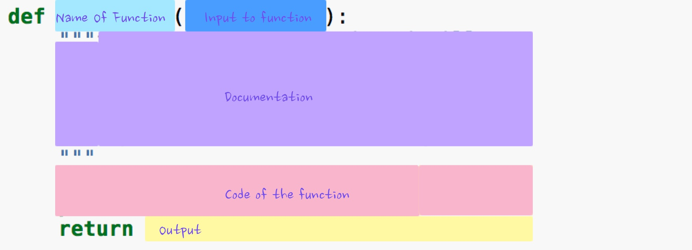

Functions
==========

After you write some code for a while, you will find it would be great to do the same thing multiple times, but with different values. Luckily there is a feature that will totally handle this for you! They are called functions.  Let's say we need to do print out names, we could write code like this::

  print("Your name is John")

But what if we want this to work for someone other than john?  Let's make something more flexible::

    name = "John"
    print("Your name is", name)

But say we want to print out someone's name more than once? We could copy and paste the print line every time we need to print out someone's name, but that is a pain, and it's even more of a pain if we ever want to change it to say something else.  This is where a function can help us out::

    def printName(name):
        print("Your name is:", name)
        return None

This is a "function", let's talk a bit about it.  functions are defined by the keyword def (think short for "define") at the beginning, then they need a name, followed by () arguments go inside the ()'s and then a : finishes off the first line.  The colon is like saying the function goes after this!  Next every line of the function has to be indented  You can indent by pressing the TAB key on your keyboard, 1 indentation per line, except when using the interactive interpreter, and then you should push the space bar 2 times.  Your function can be as many lines as you want, but generally you don't really want a function to get TOO long.  The very last line is also sort of special, return and None (both keywords).  Remember keywords are special words in python that have unique meanings.  return means this function is going to return back to whatever called it whatever comes after the word return.  In this case we are returning None, which is a special keyword that means, well None, or nothing. It's not exactly zero, since it's not a number, it's just None.  How do you call a function?  Let's do that now::
  
    >>> def printName(name):
    ...     print("Your name is:", name)
    ...     return None
    ...
    >>> printName("Tito")
    Your name is: Tito
    >>> printName("Junebug")
    Your name is: Junebug
    >>> printName("lucy")
    Your name is: lucy
    >>>

Look at that! that's awesome!  remember print() is a function as well, which we already covered. print is built-in to python, we get it for free.  printName is a function we had to write ourselves, but it's called exactly like print. Let's cover that return thing now, but let's spice up our function a little bit.  Notice when we fed it lucy, it was not capitalized, which is really annoying since names are proper nouns and should always be capitalized.  Luckily python is pretty special and has a way to capitalize things for us, so we don't have to figure it out ourselves::

    def printName(name):
        name = name.capitalize()
        print("Your name is:", name)
        return name

I did a few new things here, we are taking the argument name in, but we are going to set name to name.capitalize()  capitalize is a function that python gives us, and python attaches the function (and a bunch of others) on to all strings magically, just for our convenience. It's interesting to note that pretty much every type that python gives us comes with a bunch of functions "attached" to it like this, if you remember way back to the very beginning when we were setting up our environment, I mentioned something called dir.  You can use dir to get a list of all the functions attached to things (objects are the technical word), let's try this for a string:

>>> dir("")
['__add__', '__class__', '__contains__', '__delattr__', '__dir__', '__doc__', '__eq__',
 '__format__', '__ge__', '__getattribute__', '__getitem__', '__getnewargs__', '__gt__',
 '__hash__', '__init__', '__iter__', '__le__', '__len__', '__lt__', '__mod__', '__mul__',
 '__ne__', '__new__', '__reduce__', '__reduce_ex__', '__repr__', '__rmod__', '__rmul__',
 '__setattr__', '__sizeof__', '__str__', '__subclasshook__', 'capitalize', 'casefold',
 'center', 'count', 'encode', 'endswith', 'expandtabs', 'find', 'format', 'format_map',
 'index', 'isalnum', 'isalpha', 'isdecimal', 'isdigit', 'isidentifier', 'islower',
 'isnumeric', 'isprintable', 'isspace', 'istitle', 'isupper', 'join', 'ljust', 'lower',
 'lstrip', 'maketrans', 'partition', 'replace', 'rfind', 'rindex', 'rjust', 'rpartition',
 'rsplit', 'rstrip', 'split', 'splitlines', 'startswith', 'strip', 'swapcase', 'title',
 'translate', 'upper', 'zfill']
>>> "lucy".capitalize()
'Lucy'

Wow! look at all the things python gives us on strings!  Feel free to play with them and see what they all do. Or you can ask python what it does::

    >>> help("".capitalize)
    Help on built-in function capitalize:
    
    capitalize(...) method of builtins.str instance
        S.capitalize() -> str
    
        Return a capitalized version of S, i.e. make the first character
        have upper case and the rest lower case.
    >>>

Well that's handy! Python even has help!  What about our printName function, does it have any help?

    >>>help(printName)
    Help on function printName in module __main__:
    
    printName(name)
    >>>

Well that's not very helpful is it!  But then since we wrote it, python doesn't really know much about it, so maybe it's something we have to do as well, give our function some help::

    def printName(argumentsTo):
        """takes a name (string) and will 
		Returns the capitalized name.
        
        example: printName("lucy")
        will print: Your name is: Lucy
        """
        name = name.capitalize()
        print("Your name is:", name)
        return name

now let's see what help says::

    >>> help(printName)
    Help on function printName in module __main__:
    
    printName(name)
        takes a name (string) and will print out "Your name is:" along with the name capitalized.
        Returns the capitalized name.
    
        example: printName("lucy")
        will print: Your name is: Lucy
    >>>

Much nicer!  This "help" that we give is considered a "docstring". But having to type this function in every time you start the python interpreter is annoying. Let's fix that next! But first, things to remember/know about functions:

	* Gives you the ability to make your own commands!
	* They allow you to name some python code, like you can name variables (strings, numbers, etc.)
	* They can take arguments (any number of arguments actually)
	* Names of arguments in it's definition are not important to things outside of the function, they are only useful inside the function ("scope").
	* Functions are "black boxes", code that uses functions only care about the inputs and outputs, not the details on how it makes the output.
	* function names follow the same rules as :doc:`07-variables`.

A visual for how functions are written.
